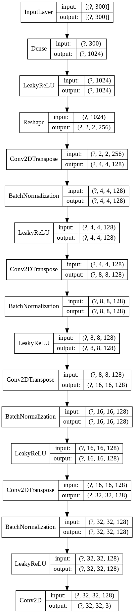

# GANs for chaotic systems

In this repository you will find the application of Generative Adversarial Networks (GANs) for the generation of data coming from the Loretnz-63 model, a chatoic model used to describe atmospheric convection. This generated data could be used after for training machine learning models.
Regression methods are also applied for characterizing the model (retrieving its parameters) and reproducing realistic data.  

The final architecture is in the file GAN CNN

